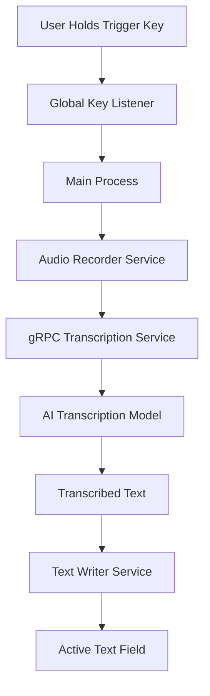

# [DEPRECATED] - This project is no longer maintained 

# Ito

<div align="center">
  
  
  <h3>Smart dictation. Everywhere you want.</h3>
  
  <p>
    <strong>Ito</strong> is an intelligent voice assistant that brings seamless voice dictation to any application on your computer. Simply hold down your trigger key, speak naturally, and watch your words appear instantly in any text field.
  </p>

  <p>
    
    
    
    
  </p>
</div>

---

## ✨ Features

### 🎙️ **Universal Voice Dictation**

- **Works in any app**: Emails, documents, chat applications, web browsers, code editors
- **Global keyboard shortcuts**: Customizable trigger keys that work system-wide
- **Real-time transcription**: High-accuracy speech-to-text powered by advanced AI models
- **Instant text insertion**: Automatically types transcribed text into the focused text field

### 🧠 **Smart & Adaptive**

- **Custom dictionary**: Add technical terms, names, and specialized vocabulary
- **Context awareness**: Learns from your usage patterns to improve accuracy
- **Multi-language support**: Transcribe in multiple languages
- **Intelligent punctuation**: Automatically adds appropriate punctuation

### ⚙️ **Powerful Customization**

- **Flexible shortcuts**: Configure any key combination as your trigger
- **Audio preferences**: Choose your preferred microphone
- **Privacy controls**: Local processing options and data control settings
- **Seamless integration**: Works with any application

### 💾 **Data Management**

- **Notes system**: Automatically save transcriptions for later reference
- **Interaction history**: Track your dictation sessions and improve over time
- **Cloud sync**: Keep your settings and data synchronized across devices
- **Export capabilities**: Export your notes and interaction data

---

## 🚀 Quick Start

### Prerequisites

- **macOS 10.15+** or **Windows 10+**
- **Node.js 20+** and **Bun** (for development)
- **Rust toolchain** (for building native components)
- **Microphone access** and **Accessibility permissions**

### Installation

1. **Download the latest release** from [heyito.ai](https://www.heyito.ai/) or the [GitHub releases page](https://github.com/heyito/ito/releases)

2. **Install the application**:
   - **macOS**: Open the `.dmg` file and drag Ito to Applications
   - **Windows**: Run the `.exe` installer and follow the setup wizard

3. **Grant permissions** when prompted:
   - **Microphone access**: Required for voice input
   - **Accessibility access**: Required for global keyboard shortcuts and text insertion

4. **Set up authentication**:
   - Sign in with Google, Apple, Github through Auth0 or create a local account
   - Complete the guided onboarding process

### First Use

1. **Configure your trigger key**: Choose a comfortable keyboard shortcut (default: `Fn + Space`)
2. **Test your microphone**: Ensure clear audio input during the setup process
3. **Try it out**: Hold your trigger key and speak into any text field
4. **Customize settings**: Adjust voice sensitivity, shortcuts, and preferences

---

## 🛠️ Development

### Building from Source

> **Important**: Ito requires a local transcription server for voice processing. See [server/README.md](server/README.md) for detailed server setup instructions.

```bash
# Clone the repository
git clone https://github.com/heyito/ito.git
cd ito

# Install dependencies
bun install

# Set up environment variables
cp .env.example .env

# Build native components (Rust binaries)
./build-binaries.sh

# Set up and start the server (required for transcription)
cd server
cp .env.example .env  # Edit with your API keys
bun install
bun run local-db-up   # Start PostgreSQL database
bun run db:migrate    # Run database migrations
bun run dev           # Start development server
cd ..

# Start the Electron app (in a new terminal)
bun run dev
```

### Build Requirements

#### All Platforms

- **Rust**: Install via [rustup.rs](https://rustup.rs/)
  - **Windows users**: See Windows-specific instructions below for GNU toolchain setup
  - **macOS/Linux users**: Default installation is sufficient

#### macOS

- **Xcode Command Line Tools**: `xcode-select --install`

#### Windows

**Required Setup:**

This setup uses git bash for shell operations. Download from [git](https://git-scm.com/downloads)

1. **Install Docker Desktop**: Download from [docker.com](https://www.docker.com/products/docker-desktop/) and ensure it's running

2. **Install Rust** (with GNU target)

Download and run the official [Rust installer for Windows](https://rustup.rs/).  
This installs `rustup` and the MSVC toolchain by default.

Add the GNU target (needed for our native components):

    rustup toolchain install stable-x86_64-pc-windows-gnu
    rustup target add x86_64-pc-windows-gnu

---

3. **Install 7-Zip**

   winget install 7zip.7zip

---

4. **Install GCC & MinGW-w64 via MSYS2**

Install [MSYS2](https://www.msys2.org/).

Open the **MSYS2 MinGW x64** shell (from the Start Menu).

Update and install the toolchain:

    pacman -Syu       # run twice if asked to restart
    pacman -S --needed mingw-w64-x86_64-toolchain

Verify the tools exist:

    ls /mingw64/bin/gcc.exe /mingw64/bin/dlltool.exe

---

5. **Use the MinGW tools when building** (Git Bash)

You normally develop and build in **Git Bash**. Before building, prepend the MinGW path:

    export PATH="/c/msys64/mingw64/bin:$PATH"
    export DLLTOOL="/c/msys64/mingw64/bin/dlltool.exe"
    export CC_x86_64_pc_windows_gnu="/c/msys64/mingw64/bin/x86_64-w64-mingw32-gcc.exe"
    export AR_x86_64_pc_windows_gnu="/c/msys64/mingw64/bin/ar.exe"
    export CARGO_TARGET_X86_64_PC_WINDOWS_GNU_LINKER="/c/msys64/mingw64/bin/x86_64-w64-mingw32-gcc.exe"

Check you’re picking up the right ones:

    which gcc       # -> /c/msys64/mingw64/bin/gcc.exe
    which dlltool   # -> /c/msys64/mingw64/bin/dlltool.exe

⚠️ **Do not add `C:\msys64\ucrt64\bin` to PATH.** That’s the wrong runtime and will break linking.

💡 To avoid running these exports every session, add the lines above to your Git Bash `~/.bashrc` file. They will be applied automatically whenever you open a new Git Bash window.

---

6.  **Restart Git Bash if you update MSYS2**

Whenever you update MSYS2 packages with `pacman -Syu`, restart Git Bash so the changes take effect.

> **Note**: Windows builds use Docker for cross-compilation to ensure consistent builds. The Docker container handles the Windows build environment automatically.

### Project Structure

```
ito/
├── app/                    # Electron renderer (React frontend)
│   ├── components/         # React components
│   ├── store/             # Zustand state management
│   └── styles/            # TailwindCSS styles
├── lib/                   # Shared library code
│   ├── main/              # Electron main process
│   ├── preload/           # Preload scripts & IPC
│   └── media/             # Audio/keyboard native interfaces
├── native/                # Native components (Rust/Swift)
│   ├── audio-recorder/    # Audio capture (Rust)
│   ├── global-key-listener/ # Keyboard events (Rust)
│   ├── text-writer/       # Text insertion (Rust)
│   └── active-application/ # Get the active application for context (Rust)
├── server/                # gRPC transcription server
│   ├── src/               # Server implementation
│   └── infra/             # AWS infrastructure (CDK)
└── resources/             # Build resources & assets
```

### Available Scripts

```bash
# Development
bun run dev                 # Start with hot reload
bun run dev:rust           # Build Rust components and start dev

# Building Native Components
bun run build:rust         # Build for current platform
bun run build:rust:mac     # Build for macOS (with universal binary)
bun run build:rust:win     # Build for Windows

# Building Application
bun run build:mac          # Build for macOS
bun run build:win          # Build for Windows
./build-app.sh mac          # Build macOS using build script
./build-app.sh windows      # Build Windows using build script (requires Docker)

# Code Quality
bun run lint               # Run ESLint
bun run format             # Run Prettier
bun run lint:fix           # Fix linting issues
```

---

## 🏗️ Architecture

### Client Architecture

**Ito** is built as a modern Electron application with a sophisticated multi-process architecture:

- **Main Process**: Handles system integration, permissions, and native component coordination
- **Renderer Process**: React-based UI with real-time audio visualization
- **Preload Scripts**: Secure IPC bridge between main and renderer processes
- **Native Components**: High-performance Rust binaries for audio capture and keyboard handling

### Technology Stack

**Frontend:**

- **Electron** - Cross-platform desktop framework
- **React 19** - Modern UI library with concurrent features
- **TypeScript** - Type-safe development
- **TailwindCSS** - Utility-first styling
- **Zustand** - Lightweight state management
- **Framer Motion** - Smooth animations

**Backend:**

- **Node.js** - Runtime environment
- **gRPC** - High-performance RPC for transcription services
- **SQLite** - Local data storage
- **Protocol Buffers** - Efficient data serialization

**Native Components:**

- **Rust** - System-level audio recording and keyboard event handling
- **Swift** - macOS-specific text manipulation and accessibility features
- **cpal** - Cross-platform audio library
- **enigo** - Cross-platform input simulation

**Infrastructure:**

- **AWS CDK** - Infrastructure as code
- **Docker** - Containerized deployments
- **Auth0** - Authentication and user management

### Communication Flow



---

## 🔧 Configuration

### Keyboard Shortcuts

Customize your trigger keys in **Settings > Keyboard**:

- **Single key**: `Space`, `Fn`, etc.
- **Key combinations**: `Cmd + Space`, `Ctrl + Shift + V`, etc.
- **Complex shortcuts**: `Fn + Cmd + Space` for advanced workflows

### Audio Settings

Fine-tune audio capture in **Settings > Audio**:

- **Microphone selection**: Choose from available input devices
- **Sensitivity adjustment**: Optimize for your voice and environment
- **Noise reduction**: Filter background noise automatically
- **Audio feedback**: Enable/disable sound effects

### Privacy & Data

Control your data in **Settings > General**:

- **Local processing**: Keep voice data on your device
- **Cloud sync**: Synchronize settings across devices
- **Analytics**: Share anonymous usage data (optional)
- **Data export**: Download your notes and interaction history

---

## 🔒 Privacy & Security

### Data Handling

- **Local-enabled**: Voice processing can be done entirely on your device or using our cloud
- **Encrypted transmission**: All network communication uses TLS encryption
- **Minimal data collection**: Only essential data is processed and stored
- **User control**: Full control and transparency over data retention and deletion

### Permissions

**Ito** requires specific system permissions to function:

- **Microphone Access**: To capture your voice for transcription
- **Accessibility Access**: To detect keyboard shortcuts and insert text
- **Network Access**: For cloud features and updates (optional)

### Open Source

This project is open source under the GNU General Public License. You can:

- Audit the source code for security and privacy
- Contribute improvements and bug fixes
- Fork and customize for your specific needs
- Report security issues through responsible disclosure

---

## 🤝 Contributing

We welcome contributions! Whether you're fixing bugs, adding features, or improving documentation, your help makes **Ito** better for everyone.

### Getting Started

1. **Fork the repository** and clone your fork
2. **Create a feature branch** from `dev`
3. **Make your changes** with clear commit messages
4. **Test thoroughly** across supported platforms
5. **Submit a pull request** with a detailed description

### Development Guidelines

- **Code Style**: Use Prettier and ESLint configurations
- **Type Safety**: Maintain strong TypeScript typing
- **Testing**: Add tests for new features
- **Documentation**: Update docs for API changes
- **Performance**: Consider impact on time between recording and text insertion

### Areas for Contribution

- **Accuracy improvements**: Better transcription algorithms
- **Language support**: Additional language models
- **UI/UX enhancements**: Better user experience
- **Platform support**: Windows stability testing, Linux compatibility
- **Documentation**: Tutorials, guides, and examples

---

## 📄 License

This project is licensed under the **GNU General Public License** - see the [LICENSE](LICENSE) file for details.

---

## 🙏 Acknowledgments

**Ito** is built with and inspired by amazing open source projects:

- **[Electron React App](https://github.com/guasam/electron-react-app)** by @guasam - The foundational template that provided our modern Electron + React architecture
- **Electron** - Cross-platform desktop apps with web technologies
- **React** - Modern UI development
- **Rust** - Systems programming language for native components
- **gRPC** - High-performance RPC framework
- **TailwindCSS** - Utility-first CSS framework

---

## 📞 Support

- **Community**: [GitHub Discussions](https://github.com/heyito/ito/discussions)
- **Issues**: [GitHub Issues](https://github.com/heyito/ito/issues)
- **Website**: [heyito.ai](https://www.heyito.ai)
